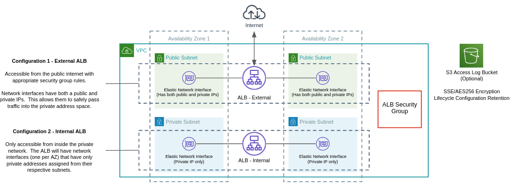

# Module - Application Load Balancer (ALB)

- [Module - Application Load Balancer (ALB)](#module---application-load-balancer-alb)
  - [Minimum Required Configuration](#minimum-required-configuration)
  - [Inputs and Outputs](#inputs-and-outputs)
    - [Inputs](#inputs)
    - [Outputs](#outputs)

This module deploys the following resources:

- ALB, optionally internal or external.
- Security Group allowing full TCP egress.  This can be referenced by other security groups to allow ingress from the ALB
- Optional S3 bucket for ALB access logs.  A bucket expiration policy allows for setting log retention in days.



## Minimum Required Configuration

Substitute the details below for your cluster.

```terraform
module "alb" {
  source     = "../relative/path/to/modules/alb"
  name       = "development"
  subnet_ids = ["subnet-XXXXXXXX", "subnet-YYYYYYYY"]
  vpc_id     = "vpc-XXXXXXXX"
}
```

## Inputs and Outputs

Inputs and outputs are generated with [terraform-docs](https://github.com/segmentio/terraform-docs)

```bash
terraform-docs markdown table . | sed s/##/###/g
```

## Providers

| Name | Version |
|------|---------|
| aws | n/a |

### Inputs

| Name | Description | Type | Default | Required |
|------|-------------|------|---------|:--------:|
| aws\_alb\_log\_account | AWS Account ID to allow permission to put logs into S3 | `map(any)` | <pre>{<br>  "ap-east-1": "754344448648",<br>  "ap-northeast-1": "582318560864",<br>  "ap-northeast-2": "600734575887",<br>  "ap-northeast-3": "383597477331",<br>  "ap-south-1": "718504428378",<br>  "ap-southeast-1": "114774131450",<br>  "ap-southeast-2": "783225319266",<br>  "ca-central-1": "985666609251",<br>  "eu-central-1": "054676820928",<br>  "eu-north-1": "897822967062",<br>  "eu-west-1": "156460612806",<br>  "eu-west-2": "652711504416",<br>  "eu-west-3": "009996457667",<br>  "me-south-1": "076674570225",<br>  "sa-east-1": "507241528517",<br>  "us-east-1": "127311923021",<br>  "us-east-2": "033677994240",<br>  "us-west-1": "027434742980",<br>  "us-west-2": "797873946194"<br>}</pre> | no |
| enable\_access\_logs | Enable access logging to S3 | `bool` | `true` | no |
| enable\_deletion\_protection | Enable deletion protection. | `bool` | `true` | no |
| existing\_log\_bucket\_name | Name of an existing ALB log bucket name.  Must be empty if log\_bucket\_name is set. | `string` | `""` | no |
| idle\_timeout | Connection idle timeout. | `string` | `60` | no |
| internal | Internal or external.  Internal cannot be reached from the internet. | `bool` | `false` | no |
| log\_bucket\_name | ALB log bucket name.  Empty value set to alb-logs-ACCOUNTID-albname in module.  Unused if existing\_log\_bucket\_name is set. | `string` | `""` | no |
| log\_expiration | Enable ALB logs in S3 to expire | `string` | `true` | no |
| log\_expiration\_days | Days before expiring ALB log in S3 | `number` | `30` | no |
| name | ALB name.  Also used for security group prefix. | `string` | n/a | yes |
| s3\_block\_all\_public\_access | Block S3 public access to the logging bucket | `bool` | `true` | no |
| security\_group\_ids | List of additional security groups to associate with cluster instances. | `list(any)` | `[]` | no |
| subnet\_ids | List of subnets ALB will be deployed in. | `list(any)` | n/a | yes |
| tags | Tags to apply to all module resources. | `map(any)` | `{}` | no |
| vpc\_id | VPC ID | `string` | n/a | yes |

### Outputs

| Name | Description |
|------|-------------|
| dns\_name | DNS name |
| id | ALB ID |
| security\_group\_id | Security group allowed access to the ALB. |
| zone\_id | Canonical hosted zone ID of the load balancer.  Used for Route 53 entries. |
