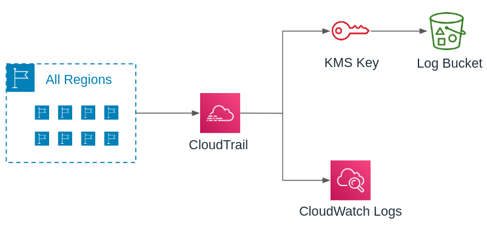

# Module - CloudTrail

- [Module - CloudTrail](#module---cloudtrail)
  - [Minimum Required Configuration](#minimum-required-configuration)
  - [Inputs and Outputs](#inputs-and-outputs)
    - [Providers](#providers)
    - [Inputs](#inputs)
    - [Outputs](#outputs)

This module enables [AWS CloudTrail](https://aws.amazon.com/cloudtrail/faqs/) to track account activity for all accounts in an organization. Each account will have a global trail, which allows it to record activity from global services such as IAM. This module can be deployed in an individual account or at the Organization root level. To enable an Organization-wide CloudTrail set `var.is_organization_trail = true.`

CloudTrail events are pushed to both a CloudWatch logs group and an S3 bucket. The CloudWatch log group has adjustable retention in days and allows for quick searching via [CloudWatch Insights](https://docs.aws.amazon.com/AmazonCloudWatch/latest/logs/AnalyzingLogData.html). The AWS S3 bucket provides long-term KMS encrypted archiving that is searchable with [AWS Athena](https://docs.aws.amazon.com/athena/latest/ug/cloudtrail-logs.html).



## Minimum Required Configuration

```terraform
data "aws_caller_identity" "current" {}

module "cloudtrail" {
  source      = "../relative/path/to/modules/cloudtrail"
  name        = "cloudtrail-${data.aws_caller_identity.current.account_id}"
  bucket_name = "cloudtrail-${data.aws_caller_identity.current.account_id}"
}
```

## Inputs and Outputs

Inputs and outputs are generated with [terraform-docs](https://github.com/segmentio/terraform-docs)

```bash
terraform-docs markdown table . | sed s/##/###/g
```

### Providers

| Name | Version |
|------|---------|
| aws | n/a |

### Inputs

| Name | Description | Type | Default | Required |
|------|-------------|------|---------|:--------:|
| bucket\_name | S3 CloudTrail bucket name.  Recommend cloudtrail-ACCOUNT\_ID. | `string` | n/a | yes |
| deny\_delete | Deny S3:Delete on the CloudTrail bucket. | `bool` | `false` | no |
| enable\_log\_file\_validation | Log file integrity validation. | `bool` | `true` | no |
| event\_source\_buckets | List of bucket names to monitor data events via CloudTrail. A single index with value '\*' will enable for all buckets | `list(string)` | `[]` | no |
| include\_global\_service\_events | Publish events from global services (IAM, etc) to this trail. | `bool` | `true` | no |
| is\_multi\_region\_trail | Collect events from all regions. | `bool` | `true` | no |
| is\_organization\_trail | Creates an organization wide CloudTrail. | `bool` | `false` | no |
| kms\_key\_deletion\_window\_in\_days | Number of days before a key is removed after being marked for deletion.  7-30 days. | `number` | `30` | no |
| kms\_key\_rotation | AWS managed rotation of KMS key.  Occurs automatically each year. | `bool` | `true` | no |
| name | Trail name.  Recommend cloudtrail-ACCOUNT\_ID. | `string` | n/a | yes |
| retention\_in\_days | CloudWatch logs retention in days. | `number` | `180` | no |
| tags | Tags to apply to all stack resources. | `map(any)` | `{}` | no |

### Outputs

| Name | Description |
|------|-------------|
| bucket\_arn | CloudTrail S3 bucket ARN |
| bucket\_name | CloudTrail S3 bucket name |
| trail\_arn | CloudTrail Trail ARN |
| trail\_name | CloudTrail Trail name |
