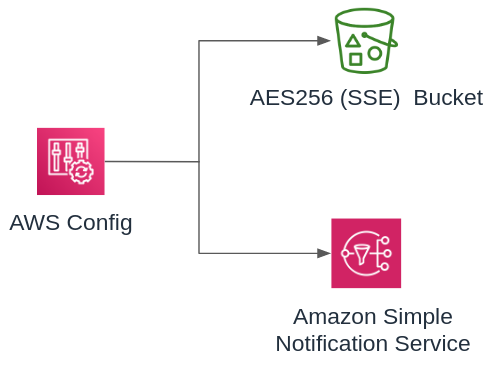

# Module - Config

- [Module - Config](#module---config)
  - [Minimum Required Configuration](#minimum-required-configuration)
  - [Inputs and Outputs](#inputs-and-outputs)
    - [Providers](#providers)
    - [Inputs](#inputs)
    - [Outputs](#outputs)

This module enables configuration recording via the [AWS Config](https://aws.amazon.com/config/faq/) service.  Configuration changes are delivered to an S3-SSE encrypted S3 bucket with a `One_Hour` frequency.  An SNS topic is also created to receive notifications on configuration changes.  There are no subscriptions to this topic by default.



## Minimum Required Configuration

```terraform
data "aws_caller_identity" "current" {}

module "config" {
  source      = "../relative/path/to/modules/config"
  bucket_name = "config-${data.aws_caller_identity.current.account_id}"
}
```

## Inputs and Outputs

Inputs and outputs are generated with [terraform-docs](https://github.com/segmentio/terraform-docs)

```bash
terraform-docs markdown table ./
```

### Providers

| Name | Version |
|------|---------|
| aws | n/a |

### Inputs

| Name | Description | Type | Default | Required |
|------|-------------|------|---------|:--------:|
| bucket\_name | S3 Config bucket name.  Recommend config-ACCOUNT\_ID. | `string` | n/a | yes |
| configuration\_recorder\_name | Name for the configuration recorder.  Only visible via API. | `string` | `"config-recorder"` | no |
| delivery\_channel\_name | Name for the delivery channel.  Only visible via API. | `string` | `"config-delivery"` | no |
| delivery\_frequency | Config snapshot delivery frequency. | `string` | `"One_Hour"` | no |
| s3\_block\_all\_public\_access | Block S3 public access to the logging bucket | `bool` | `true` | no |
| tags | Tags to apply to all stack resources. | `map(any)` | `{}` | no |
| topic\_name | SNS topic name. | `string` | `"config-notifications"` | no |

### Outputs

| Name | Description |
|------|-------------|
| config\_role\_arn | Config service-linked role ARN. |
| sns\_arn | SNS topic ARN. |
