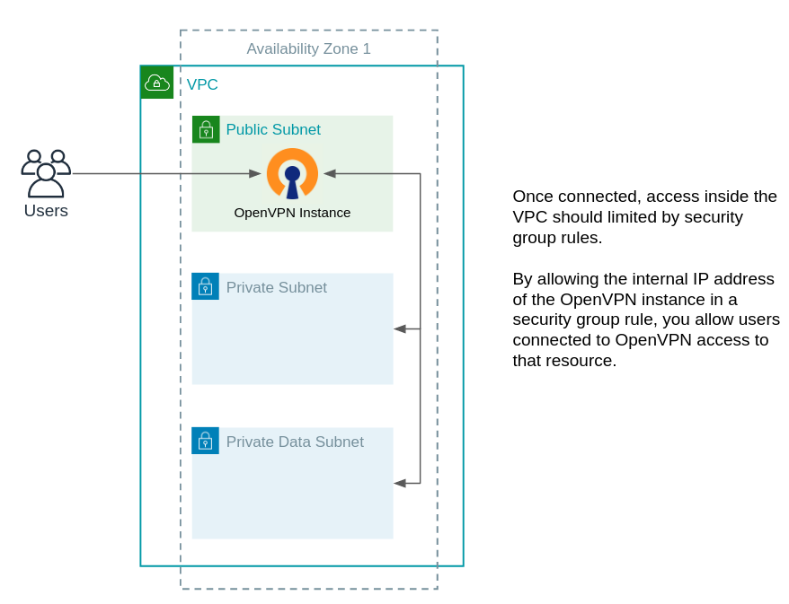
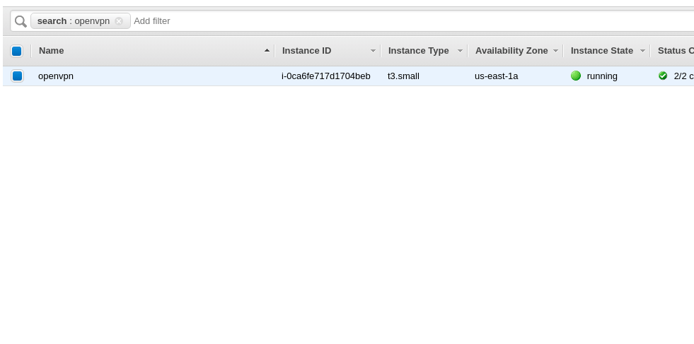

# Module - OpenVPN

- [Module - OpenVPN](#module---openvpn)
  - [Minimum Required Configuration](#minimum-required-configuration)
  - [Initial Configuration](#initial-configuration)
  - [Inputs and Outputs](#inputs-and-outputs)
    - [Inputs](#inputs)
    - [Outputs](#outputs)
  - [CloudWatch Monitoring](#cloudwatch-monitoring)

This module deploys an Amazon Linux 2 AMI running [OpenVPN Access Server](https://openvpn.net/faq/what-is-openvpn-access-server/).  It should be deployed in a public subnet to allow remote users access to internal VPC resources.



## Minimum Required Configuration

Substitute the details below for your VPC.

```terraform
module "openvpn" {
  source = "../relative/path/to/modules/ec2/openvpn"
    ami       = "ami-from-your-region"
    name      = "openvpn"
    key_name  = "existing-key-name-in-your-account"
    subnet_id = "subnet-XXXXXXXX"
    vpc_cidr  = "172.21.0.0/16"
}
```

## Initial Configuration

Before deployment:

- Collect current Amazon Linux 2 AMI in current region for use with the `ami` variable.

    ```bash
    aws ssm get-parameters --names /aws/service/ami-amazon-linux-latest/amzn2-ami-hvm-x86_64-gp2 --region YOUR_REGION
    ```

Post deployment:

- Use SSM connect to log into the instance and set the `openvpn` user's password.  This can be done via the AWS console by right clicking the EC2 instance, clicking connect, and selecting `Session Manager`.

    

- Set the set password.

    ```bash
    echo PASSWORD | sudo passwd --stdin openvpn
    ```

- Connect to the VPN at `https://<PUBLIC_IP>` using the `openvpn` user and the previously set password.
- Once connected, connect to the **internal IP** of the instance on port 943 to begin administration.  E.g. `https://<PRIVATE_IP>:943`.   Log in with the `openvpn` user.

## Inputs and Outputs

Inputs and outputs are generated with [terraform-docs](https://github.com/segmentio/terraform-docs)

```bash
terraform-docs markdown table ./
```

### Inputs

| Name | Description | Type | Default | Required |
|------|-------------|------|---------|:-----:|
| ami | Amazon Linux AMI in the target region. | `string` | n/a | yes |
| disable\_api\_termination | Termination protection. | `bool` | `true` | no |
| ebs\_encryption | Encrypt root EBS volume | `bool` | `false` | no |
| ebs\_kms\_key\_id | KMS Key ID.  Required if encryption is enabled. | `string` | `""` | no |
| enable\_ssm | Enable Systems Manager (SSM) access. \*Required to set initial password.\* | `string` | `true` | no |
| instance\_type | EC2 Instance type. | `string` | `"t3.small"` | no |
| key\_name | Key pair name. | `string` | n/a | yes |
| name | Name used for instance, IAM role, and security group. | `string` | n/a | yes |
| root\_volume\_size | Size in GB of root EBS volume. | `number` | `16` | no |
| subnet\_id | Target public subnet ID for deployment. | `string` | n/a | yes |
| tags | Tags to apply to all stack resources. | `map` | `{}` | no |
| vpc\_cidr | VPC CIDR of the target VPC. | `string` | n/a | yes |
| vpn\_ingress\_cidr | This CIDR range will be allowed to connect to ports 443 (HTTPS) and 1194 (UDP OpenVPN). | `string` | `"0.0.0.0/0"` | no |

### Outputs

| Name | Description |
|------|-------------|
| instance\_id | EC2 instance ID. |
| private\_ip | Instance private IP. |
| public\_ip | Instance public IP. |
| security\_group\_id | Security group ID. |

## CloudWatch Monitoring

Two CloudWatch alarms are created with the OpenVPN instance.  They leverage AWS recover and reboot actions respectively based on system or instance failures.  For more information, visit the [AWS Documentation](https://docs.aws.amazon.com/AWSEC2/latest/UserGuide/UsingAlarmActions.html)
