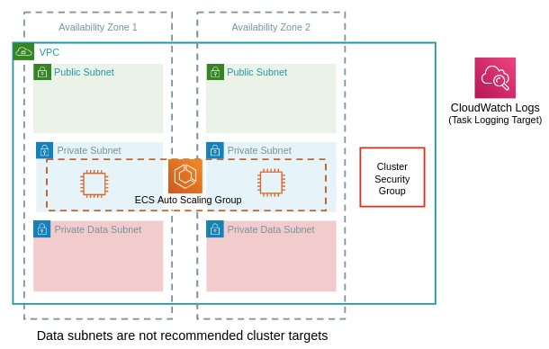

# Module - ECS Cluster

- [Module - ECS Cluster](#module---ecs-cluster)
  - [Minimum Required Configuration](#minimum-required-configuration)
  - [Inputs and Outputs](#inputs-and-outputs)
    - [Inputs](#inputs)
    - [Outputs](#outputs)

This module deploys the following resources:

- An ECS cluster, with auto scaling group (ASG).  ASG min, desired, and max are `0` by default.
- Cluster security group with full egress
- A launch configuration for use with the ASG
- CloudWatch logs group for ECS tasks - default 7 day retention.
- IAM roles - one of the cluster instances and one for ECS Agent execution
- iptables rules to prevent tasks from assuming the host role - [more details here.](https://docs.aws.amazon.com/AmazonECS/latest/developerguide/task-iam-roles.html)

It is recommended that your cluster be deployed in private subnets.



## Minimum Required Configuration

Substitute the details below for your cluster.

```terraform
module "ecs01" {
  source     = "../relative/path/to/modules/ecs/cluster"
  image_id   = "ami-XXXXXXXX"
  key_name   = "your-key-pair"
  name       = "development"
  subnet_ids = ["subnet-XXXXXXXX", "subnet-YYYYYYYY"]
  vpc_id     = "vpc-XXXXXXXX"
}
```

## Inputs and Outputs

Inputs and outputs are generated with [terraform-docs](https://github.com/segmentio/terraform-docs)

```bash
terraform-docs markdown table . | sed s/##/###/g
```

### Inputs

| Name | Description | Type | Default | Required |
|------|-------------|------|---------|:-----:|
| desired\_instances | Number of instances to launch. Default is 0. | `number` | `0` | no |
| enable\_ebs\_encryption | Enable EBS encryption on the cluster instances | `bool` | `true` | no |
| image\_id | AMI to use for ECS instances | `string` | n/a | yes |
| instance\_type | Instance type | `string` | `"t3a.small"` | no |
| key\_name | Key Pair for instance access | `string` | n/a | yes |
| log\_group\_prefix | Cloudwatch log group for ECS.  Combined with the cluster name.  Requires trailing slash. | `string` | `"/aws/ecs/"` | no |
| log\_group\_retention | Cloudwatch log group retention in days | `number` | `7` | no |
| max\_instances | Max number of instances. Default is 0. | `number` | `0` | no |
| min\_instances | Min number of instances. Default is 0. | `number` | `0` | no |
| name | Cluster name | `string` | n/a | yes |
| root\_volume\_size | Root volume size for each instance. (Must be at least as big as the AMI volume.) | `number` | `40` | no |
| security\_group\_ids | List of additional security groups to associate with cluster instances. | `list` | `[]` | no |
| subnet\_ids | List of subnets cluster instances will be deployed in. | `list` | n/a | yes |
| tags | Tags to apply to all module resources. | `map` | `{}` | no |
| user\_data | User data script to run at instance launch. | `string` | `" "` | no |
| vpc\_id | VPC ID | `string` | n/a | yes |

### Outputs

| Name | Description |
|------|-------------|
| arn | Cluster ARN |
| execution\_role\_arn | Execution IAM role ARN |
| id | Cluster ID |
| name | Cluster Name |
| security\_group\_id | Security group ID attached to cluster instances |
| tasks\_log\_group\_name | Name of the CloudWatch logs group for cluster tasks |
