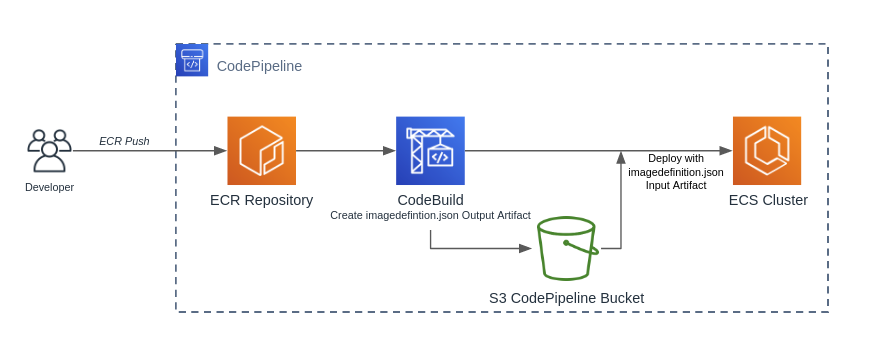

# Module - ECR to ECS Deployment

- [Module - ECR to ECS Deployment](#module---ecr-to-ecs-deployment)
  - [Requirements](#requirements)
  - [Minimum Required Configuration](#minimum-required-configuration)
  - [Inputs and Outputs](#inputs-and-outputs)
    - [Inputs](#inputs)
    - [Outputs](#outputs)

This module creates a Code Pipeline with supporting CodeBuild project to deploy an ECS service update.   The pipeline is triggered by a container push.  The Terraform AWS provider does not currently create the appropriate linking of ECR to CodePipeline on container push.  Because of this, the `role_codepipeline_invoke_arn` is required.   See this [GitHub Issue](https://github.com/terraform-providers/terraform-provider-aws/issues/7012) for more details.

As a temporary measure, that role must be able to be assumed by `events.amazonaws.com` and have IAM permissions for `codepipeline:startPipeline` on the pipeline resource.  There is an example of these resources [here](docs/codepipeline-invoke-example.tf).  These resources may be deprecated when the above mentioned GitHub issue is resolved.

The diagram below represents the general workflow.



## Requirements

- CodeBuild and CodePipeline service roles
- Existing S3 bucket for CodeBuild
- Existing ECR repository
- Existing ECS service

## Minimum Required Configuration

```terraform
module "example-ecr-deployment" {
  source                       = "../relative/path/to/modules/ecs/ecr-deployment"
  cluster_name                 = "my-cluster"
  name                         = "my-service-name"
  repo_url                     = "9999999999999.dkr.ecr.<SOME_REGION>.amazonaws.com/example-repo"
  role_codepipeline_invoke_arn = "arn:aws:iam::99999999999:role/codepipeline-invoke-role"
  s3_codepipeline_bucket       = "company-environment-codepipeline"
  service_codebuild_arn        = "arn:aws:iam::99999999999:role/codebuild-service-role"
  service_codepipeline_arn     = "arn:aws:iam::99999999999:role/codepipeline-service-role"
  service_name                 = "my-service-name"
}
```

## Inputs and Outputs

Inputs and outputs are generated with [terraform-docs](https://github.com/segmentio/terraform-docs)

```bash
terraform-docs markdown table . | sed s/##/###/g
```

### Inputs

| Name | Description | Type | Default | Required |
|------|-------------|------|---------|:-----:|
| build\_timeout | CodeBuild project timeout in minutes | `number` | `5` | no |
| cluster\_name | Target ECS cluster Name | `string` | n/a | yes |
| description | CodeBuild description | `string` | `"ECR to ECS imagedefinitions.json builder."` | no |
| image\_tag | Image tag to be deployed. | `string` | `"latest"` | no |
| name | Used by CodeBuild and CodePipeline.  Recommend container name. | `string` | n/a | yes |
| repo\_url | Source ECR repository URL - E.g 999999999999.dkr.ecr.us-east-1.amazonaws.com/example-repo | `string` | n/a | yes |
| role\_codepipeline\_invoke\_arn | ARN of the IAM role that allows CloudWatch Events to invoke CodePipeline | `string` | n/a | yes |
| s3\_codepipeline\_bucket | S3 CodePipeline Bucket | `string` | n/a | yes |
| service\_codebuild\_arn | CodeBuild Service Role ARN | `string` | n/a | yes |
| service\_codepipeline\_arn | CodePipeline Service Role ARN | `string` | n/a | yes |
| service\_name | Target ECS Service Name | `string` | n/a | yes |
| tags | Tags to apply to all module resources. | `map` | `{}` | no |

### Outputs

| Name | Description |
|------|-------------|
| pipeline\_arn | CodePipeline ARN |
| pipeline\_id | CodePipeline ID |
| project\_arn | CodeBuild project ARN |
| project\_name | CodeBuild project name |
