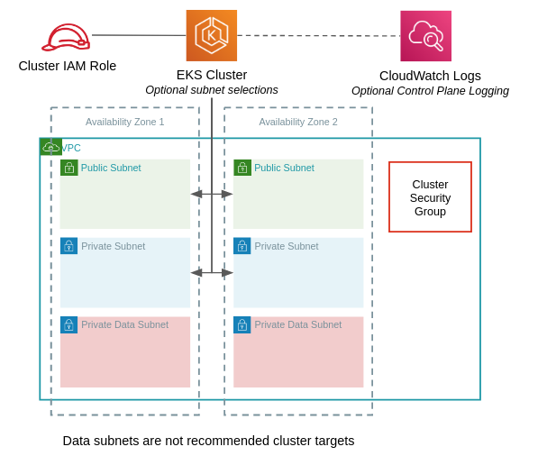

# Module - EKS Cluster

- [Module - EKS Cluster](#module---eks-cluster)
  - [VPC Tagging Requirements](#vpc-tagging-requirements)
  - [Minimum Required Configuration](#minimum-required-configuration)
  - [Inputs and Outputs](#inputs-and-outputs)
    - [Inputs](#inputs)
    - [Outputs](#outputs)
  - [Service Account IAM Roles](#service-account-iam-roles)

This module deploys an EKS Cluster in specific subnets within a VPC.  It does *not* create EKS node groups.



## VPC Tagging Requirements

The EKS service will add tags to the VPC and target subnets.  Use [ignore_tags](https://registry.terraform.io/providers/hashicorp/aws/latest/docs#ignore_tags-configuration-block) in your AWS provider definition to prevent tag removal by your VPC module.

For more information on EKS tagging considerations see the [AWS Documentation](https://docs.aws.amazon.com/eks/latest/userguide/network_reqs.html#vpc-tagging)

```terraform
provider "aws" {
  region  = <YOUR_REGION>
  profile = <YOUR_PROFILE>
  ignore_tags {
    key_prefixes = ["kubernetes.io/"]
  }
}
```

## Minimum Required Configuration

Substitute the details below for your cluster.

```terraform
module "eks-cluster" {
  source                   = "../relative/path/to/modules/eks/cluster"
  name                     = "test_cluster"
  vpc_id                   = "vpc-XXXXXXXX"
  worker_security_group_id = "sg-XXXXXXXX"  # Security group in the same VPC that will be attached to workers
  subnet_ids               = ["subnet-XXXXXXXX", "subnet-YYYYYYYY"]
}
```

## Inputs and Outputs

Inputs and outputs are generated with [terraform-docs](https://github.com/segmentio/terraform-docs)

```bash
terraform-docs markdown table ./
```

### Inputs

| Name | Description | Type | Default | Required |
|------|-------------|------|---------|:-----:|
| cluster\_enabled\_log\_types | Control plane logging.  Empty list disables.  List containing any/all of the following enables: api, audit, authenticator, controllerManager, scheduler | `list(string)` | `[]` | no |
| cluster\_endpoint\_private\_access | Limit cluster API access to internal network only | `bool` | `true` | no |
| cluster\_endpoint\_public\_access | Allow public internet API access to cluster API | `bool` | `false` | no |
| cluster\_log\_retention | Cluster's CloudWatch log group retention in days.  Cluster logs must be enabled. | `number` | `7` | no |
| cluster\_version | EKS cluster version | `string` | `"1.14"` | no |
| name | Name used for cluster, IAM role, and security group. | `string` | n/a | yes |
| subnet\_ids | List of subnets IDs to for cluster deployment | `list(string)` | n/a | yes |
| tags | Tags to apply to all stack resources | `map` | `{}` | no |
| vpc\_id | Target VPC ID | `string` | n/a | yes |
| worker\_security\_group\_id | Security group ID attached to the EKS worker nodes | `string` | n/a | yes |

### Outputs

| Name | Description |
|------|-------------|
| arn | Cluster ARN |
| assume\_role\_policy | JSON assume role policy roles the cluster pods can assume |
| endpoint | Cluster Endpoint |
| id | Cluster ID |
| role\_arn | Cluster role ARN |
| security\_group\_id | Security group created by EKS service for the cluster |

## Service Account IAM Roles

Review the [AWS documentation](https://docs.aws.amazon.com/eks/latest/userguide/iam-roles-for-service-accounts.html) for linking Kubernetes Service Accounts to IAM roles.

As part of this module, an [IAM OpenID Connect Provider](https://docs.aws.amazon.com/IAM/latest/UserGuide/id_roles_providers_create_oidc.html) is created and paired with the cluster identity.  The required role assumption policy is available as a module output.

Below is an example Terraform definition for an IAM role that can be assumed by your cluster.  Adjust name, policy, and module name to suit your requirements.

```terraform
resource "aws_iam_role" "my_service" {
  name_prefix           = "my_service"
  path                  = "/"
  force_detach_policies = true
  assume_role_policy    = module.my_cluster.assume_role_policy
}

resource "aws_iam_role_policy_attachment" "read_only" {
  policy_arn = "arn:aws:iam::aws:policy/ReadOnlyAccess"
  role       = aws_iam_role.my_service.name
}
```
